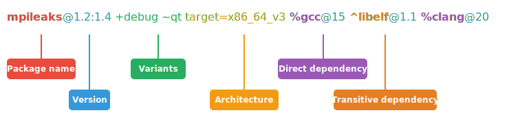

.. Copyright Spack Project Developers. See COPYRIGHT file for details.

   SPDX-License-Identifier: (Apache-2.0 OR MIT)

.. meta::
   :description lang=en:
      A detailed guide to the Spack spec syntax for describing package constraints, including versions, variants, and dependencies.

.. _sec-specs:

Spec Syntax
===========

Spack has a specific syntax to describe package constraints.
Each constraint is individually referred to as a *spec*. Spack uses specs to:

1. Refer to a particular build configuration of a package, or
2. Express requirements, or preferences, on packages via configuration files, or
3. Query installed packages, or buildcaches

Specs are more than a package name and a version; you can use them to
specify the compiler, compiler version, architecture, compile options,
and dependency options for a build. In this section, we'll go over
the full syntax of specs.

Here is an example of using a complex spec to install a very specific configuration of ``mpileaks``:

.. code-block:: spec

   $ spack install mpileaks@1.2:1.4 +debug ~qt target=x86_64_v3 %gcc@15.1.0 ^libelf@1.1 %gcc@14.2.0

The figure below helps getting a sense of the various parts that compose this spec:

If used to install a package, this will install:

* The ``mpileaks`` library at some version between ``1.2`` and ``1.4`` (inclusive),
* with ``debug`` options enabled, and without ``qt`` support,
* for an ``x86_64_v3`` architecture,
* built using ``gcc`` at version ``15.1.0``,
* depending on ``libelf`` at version ``1.1``, built with ``gcc`` at version ``14.2.0``.

Most specs will not be as complicated as this one, but this is a good example of what is possible with specs.
There are a few general rules that we can already infer from this first example:

1. Users can be as vague, or as specific, as they want about the details of building packages
2. The spec syntax is recursive, i.e. each dependency after ``%`` or ``^`` is a spec itself
3. Transitive dependencies come after the ``^`` sigil, and they always refer to the root package
4. Direct dependencies come after the ``%`` sigil, and they refer either to the root package, or to the last transitive dependency defined

The flexibility the spec syntax offers in specifying the details of a build makes Spack good for beginners and experts alike.

.. _software-model:

Software Model
--------------

To really understand what's going on above, we need to think about how software is structured.
An executable or a library generally depends on other libraries in order to run.
We can represent the relationship between a package and its dependencies as a graph.
Here is a simplified dependency graph for ``mpileaks``:

.. graphviz::

   digraph {
       node[
         fontname=Monaco,
         penwidth=2,
         fontsize=124,
         margin=.4,
         shape=box,
         fillcolor=lightblue,
         style="rounded,filled"
       ]

       mpileaks -> { mpich callpath }
       callpath -> { mpich dyninst }
       dyninst  -> libdwarf -> libelf
       dyninst  -> libelf
   }

Each box above is a package, and each arrow represents a dependency on some other package.
For example, we say that the package ``mpileaks`` *depends on* ``callpath`` and ``mpich``.
``mpileaks`` also depends *indirectly* on ``dyninst``, ``libdwarf``, and ``libelf``, in that these libraries are dependencies of ``callpath``.
To install ``mpileaks``, Spack has to build all of these packages.
Dependency graphs in Spack have to be acyclic, and the *depends on* relationship is directional, so this is a *directed, acyclic graph* or *DAG*.

The package name identifier in the spec is the root of some dependency DAG, and the DAG itself is implicit.
Spack knows the precise dependencies among packages, but users do not need to know the full DAG structure.
Each ``^`` in the full spec refers to a *transitive* dependency of the root package.
Each ``%`` refers to a *direct* dependency, either of the root, or of the last defined transitive dependency .

Spack allows only a single configuration of each package, where that is needed for consistency.
Above, both ``mpileaks`` and ``callpath`` depend on ``mpich``, but ``mpich`` appears only once in the DAG.
You cannot build an ``mpileaks`` version that depends on one version of ``mpich`` *and* on a ``callpath`` version that depends on some *other* version of ``mpich``.
In general, such a configuration would likely behave unexpectedly at runtime, and Spack enforces this to ensure a consistent runtime environment.

The purpose of specs is to abstract this full DAG away from Spack users.
A user who does not care about the DAG at all, can refer to ``mpileaks`` by simply writing:

.. code-block:: spec

   mpileaks

The spec becomes only slightly more complicated, if that user knows that ``mpileaks`` indirectly uses ``dyninst`` and wants a particular version of ``dyninst``:

.. code-block:: spec

   mpileaks ^dyninst@8.1

Spack will fill in the rest of the details before installing the spec.
The user only needs to know package names and minimal details about their relationship.
You can put all the same modifiers on dependency specs that you would put on the root spec.
That is, you can specify their versions, variants, and architectures just like any other spec.
Specifiers are associated with the nearest package name to their left.

The order of transitive package dependencies doesn't matter when writing a spec.
For example, these two specs represent exactly the same configuration:

.. code-block:: spec

   mpileaks ^callpath@1.0 ^libelf@0.8.3
   mpileaks ^libelf@0.8.3 ^callpath@1.0

Direct dependencies specified with ``%`` associate with the most recent transitive node, or with the root of the DAG.
So in the spec:

.. code-block:: spec

   root %dep1 ^transitive %dep2 %dep3

``dep1`` is a direct dependency of ``root``, while both ``dep2`` and ``dep3`` are direct dependencies of ``transitive``.

.. admonition:: Windows Spec Syntax Caveats
   :class: note

   Windows has a few idiosyncrasies when it comes to the Spack spec syntax and the use of certain shells.
   Spack's spec dependency syntax uses the carat (``^``) character; however, this is an escape string in CMD,
   so it must be escaped with an additional carat (i.e., ``^^``).
   CMD also will attempt to interpret strings with ``=`` characters in them. Any spec including this symbol
   must double-quote the string.

   Note: All of these issues are unique to CMD; they can be avoided by using PowerShell.

   For more context on these caveats, see the related issues: `carat <https://github.com/spack/spack/issues/42833>`_ and `equals <https://github.com/spack/spack/issues/43348>`_.

Below are more details about the specifiers that you can add to specs.

.. _version-specifier:

Version specifier
-----------------

A version specifier

.. code-block:: spec

   pkg@specifier

comes after a package name and starts with ``@``.
It can be something abstract that matches multiple known versions or a specific version.

The version specifier usually represents *a range of versions*:

.. code-block:: spec

   # All versions between v1.0 and v1.5.
   # This includes any v1.5.x version
   @1.0:1.5

   # All versions up to and including v3
   # This would include v3.4 etc.
   @:3

   # All versions above and including v4.2
   @4.2:

but can also be *a specific version*:

.. code-block:: spec

   # Exactly version v3.2, will NOT match v3.2.1 etc.
   @=3.2

As a shorthand, ``@3`` is equivalent to the range ``@3:3`` and includes any version with major version ``3``.
Versions are ordered lexicographically by their components.
For more details on the order, see :ref:`the packaging guide <version-comparison>`.

Notice that you can distinguish between the specific version ``@=3.2`` and the range ``@3.2``.
This is useful for packages that follow a versioning scheme that omits the zero patch version number: ``3.2``, ``3.2.1``, ``3.2.2``, etc.
In general, it is preferable to use the range syntax ``@3.2``, because ranges also match versions with one-off suffixes, such as ``3.2-custom``.

A version specifier can also be a list of ranges and specific versions, separated by commas.
For example:

.. code-block:: spec

   @1.0:1.5,=1.7.1

matches any version in the range ``1.0:1.5`` and the specific version ``1.7.1``.

Git versions
^^^^^^^^^^^^

For packages with a ``git`` attribute, ``git`` references
may be specified instead of a numerical version (i.e., branches, tags,
and commits). Spack will stage and build based off the ``git``
reference provided. Acceptable syntaxes for this are:

.. code-block:: spec

   # commit hashes
   foo@abcdef1234abcdef1234abcdef1234abcdef1234  # 40 character hashes are automatically treated as git commits
   foo@git.abcdef1234abcdef1234abcdef1234abcdef1234

   # branches and tags
   foo@git.develop  # use the develop branch
   foo@git.0.19  # use the 0.19 tag

Spack always needs to associate a Spack version with the git reference,
which is used for version comparison. This Spack version is heuristically
taken from the closest valid git tag among the ancestors of the git ref.

Once a Spack version is associated with a git ref, it is always printed with
the git ref. For example, if the commit ``@git.abcdefg`` is tagged
``0.19``, then the spec will be shown as ``@git.abcdefg=0.19``.

If the git ref is not exactly a tag, then the distance to the nearest tag
is also part of the resolved version. ``@git.abcdefg=0.19.git.8`` means
that the commit is 8 commits away from the ``0.19`` tag.

In cases where Spack cannot resolve a sensible version from a git ref,
users can specify the Spack version to use for the git ref. This is done
by appending ``=`` and the Spack version to the git ref. For example:

.. code-block:: spec

   foo@git.my_ref=3.2 # use the my_ref tag or branch, but treat it as version 3.2 for version comparisons
   foo@git.abcdef1234abcdef1234abcdef1234abcdef1234=develop # use the given commit, but treat it as develop for version comparisons

Details about how versions are compared and how Spack determines if
one version is less than another are discussed in the developer guide.

.. _basic-variants:

Variants
--------

Variants are named options associated with a particular package and are typically used to enable or disable certain features at build time.
They are optional, as each package must provide default values for each variant it makes available.

The variants available for a particular package are defined by the package author.
``spack info <package>`` will provide information on what build variants are available.

There are different types of variants.

Boolean Variants
^^^^^^^^^^^^^^^^

Typically used to enable or disable a feature at compile time.
For example, a package might have a ``debug`` variant that can be explicitly enabled with:

.. code-block:: spec

   +debug

and disabled with

.. code-block:: spec

   ~debug

Single-valued Variants
^^^^^^^^^^^^^^^^^^^^^^

Often used to set defaults.
For example, a package might have a ``compression`` variant that determines the default compression algorithm, which users could set to:

.. code-block:: spec

   compression=gzip

or

.. code-block:: spec

   compression=zstd

Multi-valued Variants
^^^^^^^^^^^^^^^^^^^^^

A package might have a ``fabrics`` variant that determines which network fabrics to support.
Users could activate multiple values at the same time. For instance:

.. code-block:: spec

   fabrics=verbs,ofi

enables both InfiniBand verbs and OpenFabrics interfaces.
The values are separated by commas.

The meaning of ``fabrics=verbs,ofi`` is to enable *at least* the specified fabrics, but other fabrics may be enabled as well.
If the intent is to enable *only* the specified fabrics, then the:

.. code-block:: spec

   fabrics:=verbs,ofi

syntax should be used with the ``:=`` operator.

.. admonition:: Alternative ways to deactivate Boolean Variants
   :class: note

   In certain shells, the ``~`` character expands to the home directory.
   To avoid these issues, avoid whitespace between the package name and the variant:

   .. code-block:: spec

      mpileaks ~debug   # shell may try to substitute this!
      mpileaks~debug    # use this instead

   Alternatively, you can use the ``-`` character to disable a variant, but be aware that this requires a space between the package name and the variant:

   .. code-block:: spec

      mpileaks-debug     # wrong: refers to a package named "mpileaks-debug"
      mpileaks -debug    # right: refers to a package named mpileaks with debug disabled

   As a last resort, ``debug=False`` can also be used to disable a boolean variant.

Variant propagation to dependencies
^^^^^^^^^^^^^^^^^^^^^^^^^^^^^^^^^^^

Spack allows variants to propagate their value to the package's
dependencies by using ``++``, ``--``, and ``~~`` for boolean variants.
For example, for a ``debug`` variant:

.. code-block:: spec

    mpileaks ++debug   # enabled debug will be propagated to dependencies
    mpileaks +debug    # only mpileaks will have debug enabled

To propagate the value of non-boolean variants Spack uses ``name==value``.
For example, for the ``stackstart`` variant:

.. code-block:: spec

    mpileaks stackstart==4   # variant will be propagated to dependencies
    mpileaks stackstart=4    # only mpileaks will have this variant value

Spack also allows variants to be propagated from a package that does
not have that variant.

Binary Provenance
^^^^^^^^^^^^^^^^^

Spack versions are paired to attributes that determine the source code Spack
will use to build. Checksummed assets are preferred but there are a few
notable exceptions such as git branches and tags i.e ``pkg@develop``.
These versions do not naturally have source provenance because they refer to a range
of commits (branches) or can be changed outside the spack packaging infrastructure
(tags). Without source provenance we cannot have binary provenance.

Spack has a reserved variant to allow users to complete source and binary provenance
for these cases: ``pkg@develop commit=<SHA>``.  The ``commit`` variant must be supplied
using the full 40 character commit SHA. Using a partial commit SHA or assigning
the ``commit`` variant to a version that is not using a branch or tag reference will
lead to an error during concretization.

Spack will attempt to establish binary provenance by looking up commit SHA's for branch
and tag based versions during concretization. There are 3 sources that it uses. In order, they
are

1. Staged source code (already cached source code for the version needing provenance)
2. Source mirrors (compressed archives of the source code)
3. The git url provided in the package definition

If Spack is unable to determine what the commit should be
during concretization a warning will be issued. Users may also specify which commit SHA they
want with the spec since it is simply a variant. In this case, or in the case of develop specs
(see :ref:`develop-specs`), Spack will skip attempts to assign the commit SHA automatically.

.. note::

   Users wanting to track the latest commits from the internet should utilize ``spack clean --stage``
   prior to concretization to clean out old stages that will short-circuit internet queries.
   Disabling source mirrors or ensuring they don't contain branch/tag based versions will also
   be necessary.

   Above all else, the most robust way to ensure binaries have their desired commits is to provide
   the SHAs via user-specs or config i.e. ``commit=<SHA>``.

Compiler Flags
--------------

Compiler flags are specified using the same syntax as non-boolean variants,
but fulfill a different purpose. While the function of a variant is set by
the package, compiler flags are used by the compiler wrappers to inject
flags into the compile line of the build. Additionally, compiler flags can
be inherited by dependencies by using ``==``.
``spack install libdwarf cppflags=="-g"`` will install both libdwarf and
libelf with the ``-g`` flag injected into their compile line.

Notice that the value of the compiler flags must be quoted if it
contains any spaces. Any of ``cppflags=-O3``, ``cppflags="-O3"``,
``cppflags='-O3'``, and ``cppflags="-O3 -fPIC"`` are acceptable, but
``cppflags=-O3 -fPIC`` is not. Additionally, if the value of the
compiler flags is not the last thing on the line, it must be followed
by a space. The command ``spack install libelf cppflags="-O3"%intel``
will be interpreted as an attempt to set ``cppflags="-O3%intel"``.

The six compiler flags are injected in the same order as implicit make commands
in GNU Autotools. If all flags are set, the order is
``$cppflags $cflags|$cxxflags $ldflags <command> $ldlibs`` for C and C++, and
``$fflags $cppflags $ldflags <command> $ldlibs`` for Fortran.

.. _architecture_specifiers:

Architecture specifiers
-----------------------

Each node in the dependency graph of a spec has an architecture attribute.
This attribute is a triplet of platform, operating system, and processor.
You can specify the elements either separately by using
the reserved keywords ``platform``, ``os``, and ``target``:

.. code-block:: spec

   $ spack install libelf platform=linux
   $ spack install libelf os=ubuntu18.04
   $ spack install libelf target=broadwell

Normally, users don't have to bother specifying the architecture if they
are installing software for their current host, as in that case the
values will be detected automatically. If you need fine-grained control
over which packages use which targets (or over *all* packages' default
target), see :ref:`package-preferences`.

.. _support-for-microarchitectures:

Support for specific microarchitectures
^^^^^^^^^^^^^^^^^^^^^^^^^^^^^^^^^^^^^^^

Spack knows how to detect and optimize for many specific microarchitectures and encodes this information in the ``target`` portion of the architecture specification.
A complete list of the microarchitectures known to Spack can be obtained in the following way:

.. command-output:: spack arch --known-targets

When a spec is installed, Spack matches the compiler being used with the microarchitecture being targeted to inject appropriate optimization flags at compile time.
Giving a command such as the following:

.. code-block:: spec

   $ spack install zlib%gcc@14.2.0 target=icelake

will produce compilation lines similar to:

.. code-block:: console

   $ /usr/bin/gcc-14 -march=icelake-client -mtune=icelake-client -c ztest10532.c
   $ /usr/bin/gcc-14 -march=icelake-client -mtune=icelake-client -c -fPIC -O2 ztest10532.
   ...

where the flags ``-march=icelake-client -mtune=icelake-client`` are injected by Spack based on the requested target and compiler.

If Spack knows that the requested compiler can't optimize for the current target
or can't build binaries for that target at all, it will exit with a meaningful error message:

.. code-block:: spec

   $ spack install zlib%gcc@5.5.0 target=icelake
   ==> Error: cannot produce optimized binary for micro-architecture "icelake" with gcc@5.5.0 [supported compiler versions are 8:]

Conversely, if an old compiler is selected for a newer microarchitecture, Spack will optimize for the best match it can find instead
of failing:

.. code-block:: spec

   $ spack arch
   linux-ubuntu18.04-broadwell

   $ spack spec zlib%gcc@4.8
   Input spec
   --------------------------------
   zlib%gcc@4.8

   Concretized
   --------------------------------
   zlib@1.2.11%gcc@4.8+optimize+pic+shared arch=linux-ubuntu18.04-haswell

   $ spack spec zlib%gcc@9.0.1
   Input spec
   --------------------------------
   zlib%gcc@9.0.1

   Concretized
   --------------------------------
   zlib@1.2.11%gcc@9.0.1+optimize+pic+shared arch=linux-ubuntu18.04-broadwell

In the snippet above, for instance, the microarchitecture was demoted to ``haswell`` when
compiling with ``gcc@4.8`` because support to optimize for ``broadwell`` starts from ``gcc@4.9:``.

Finally, if Spack has no information to match compiler and target, it will
proceed with the installation but avoid injecting any microarchitecture-specific
flags.

.. _sec-virtual-dependencies:

Virtual dependencies
--------------------

The dependency graph for ``mpileaks`` we saw above wasn't *quite* accurate.
``mpileaks`` uses MPI, which is an interface that has many different implementations.
Above, we showed ``mpileaks`` and ``callpath`` depending on ``mpich``, which is one *particular* implementation of MPI.
However, we could build either with another implementation, such as ``openmpi`` or ``mvapich``.

Spack represents interfaces like this using *virtual dependencies*.
The real dependency DAG for ``mpileaks`` looks like this:

.. graphviz::

   digraph {
       node[
         fontname=Monaco,
         penwidth=2,
         fontsize=124,
         margin=.4,
         shape=box,
         fillcolor=lightblue,
         style="rounded,filled"
       ]

       mpi [color=red]
       mpileaks -> mpi
       mpileaks -> callpath -> mpi
       callpath -> dyninst
       dyninst  -> libdwarf -> libelf
       dyninst  -> libelf
   }

Notice that ``mpich`` has now been replaced with ``mpi``.
There is no *real* MPI package, but some packages *provide* the MPI interface, and these packages can be substituted in for ``mpi`` when ``mpileaks`` is built.

Spack is unique in that its virtual packages can be versioned, just like regular packages.
A particular version of a package may provide a particular version of a virtual package.
A package can *depend on* a particular version of a virtual package.
For instance, if an application needs MPI-2 functions, it can depend on ``mpi@2:`` to indicate that it needs some implementation that provides MPI-2 functions.

Constraining virtual packages
^^^^^^^^^^^^^^^^^^^^^^^^^^^^^

When installing a package that depends on a virtual package, you can opt to specify the particular provider you want to use, or you can let Spack pick.
For example, if you just type this:

.. code-block:: spec

   $ spack install mpileaks

Then Spack will pick a provider for you according to site policies.
If you really want a particular version, say ``mpich``, then you could run this instead:

.. code-block:: spec

   $ spack install mpileaks ^mpich

This forces Spack to use some version of ``mpich`` for its implementation.
As always, you can be even more specific and require a particular ``mpich`` version:

.. code-block:: spec

   $ spack install mpileaks ^mpich@3

The ``mpileaks`` package in particular only needs MPI-1 commands, so
any MPI implementation will do. If another package depends on
``mpi@2`` and you try to give it an insufficient MPI implementation
(e.g., one that provides only ``mpi@:1``), then Spack will raise an
error. Likewise, if you try to plug in some package that doesn't
provide MPI, Spack will raise an error.

.. _explicit-binding-virtuals:

Explicit binding of virtual dependencies
^^^^^^^^^^^^^^^^^^^^^^^^^^^^^^^^^^^^^^^^

There are packages that provide more than just one virtual dependency. When interacting with them, users
might want to utilize just a subset of what they could provide and use other providers for virtuals they
need.

It is possible to be more explicit and tell Spack which dependency should provide which virtual, using a
special syntax:

.. code-block:: spec

   $ spack spec strumpack ^mpi=intel-parallel-studio+mkl ^lapack=openblas

Concretizing the spec above produces the following DAG:

.. figure:: images/strumpack_virtuals.svg

where ``intel-parallel-studio`` *could* provide ``mpi``, ``lapack``, and ``blas`` but is used only for the former. The ``lapack``
and ``blas`` dependencies are satisfied by ``openblas``.

Specifying Specs by Hash
^^^^^^^^^^^^^^^^^^^^^^^^

Complicated specs can become cumbersome to enter on the command line,
especially when many of the qualifications are necessary to distinguish
between similar installs. To avoid this, when referencing an existing spec,
Spack allows you to reference specs by their hash. We previously
discussed the spec hash that Spack computes. In place of a spec in any
command, substitute ``/<hash>`` where ``<hash>`` is any amount from
the beginning of a spec hash.

For example, let's say that you accidentally installed two different
``mvapich2`` installations. If you want to uninstall one of them but don't
know what the difference is, you can run:

.. code-block:: spec

   $ spack find --long mvapich2
   ==> 2 installed packages.
   -- linux-centos7-x86_64 / gcc@6.3.0 ----------
   qmt35td mvapich2@2.2%gcc
   er3die3 mvapich2@2.2%gcc

You can then uninstall the latter installation using:

.. code-block:: spec

   $ spack uninstall /er3die3

Or, if you want to build with a specific installation as a dependency,
you can use:

.. code-block:: spec

   $ spack install trilinos ^/er3die3

If the given spec hash is sufficiently long as to be unique, Spack will
replace the reference with the spec to which it refers. Otherwise, it will
prompt for a more qualified hash.

Note that this will not work to reinstall a dependency uninstalled by ``spack uninstall --force``.

Dependency edge attributes
--------------------------

Some specs require additional information about the relationship between a package and its dependency.
This information lives on the edge between the two, and can be specified by following the dependency sigil with square-brackets.
Edge attributes are always specified as key-value pairs:

.. code-block:: spec

   root ^[key=value] dep

In the following sections we'll discuss the edge attributes that are currently allowed in the spec syntax.

Virtuals on edges
^^^^^^^^^^^^^^^^^

Packages can provide, or depend on, multiple virtual packages.
Users can select which virtuals to use from which dependency by specifying the ``virtuals`` edge attribute:

.. code-block:: spec

   $ spack install mpich %[virtuals=c,cxx] clang %[virtuals=fortran] gcc

The command above tells Spack to use ``clang`` to provide the ``c`` and ``cxx`` virtuals, and ``gcc`` to provide the ``fortran`` virtual.

The special syntax we have seen in :ref:`explicit-binding-virtuals` is a more compact way to specify the ``virtuals`` edge attribute.
For instance, an equivalent formulation of the command above is:

.. code-block:: spec

   $ spack install mpich %c,cxx=clang %fortran=gcc

Conditional dependencies
^^^^^^^^^^^^^^^^^^^^^^^^

Conditional dependencies allow dependency constraints to be applied only under certain conditions.
We can express conditional constraint by specifying the ``when`` edge attribute:

.. code-block:: spec

   $ spack install hdf5 ^[when=+mpi] mpich@3.1

This tells Spack that hdf5 should depend on ``mpich@3.1`` if it is configured with MPI support.
